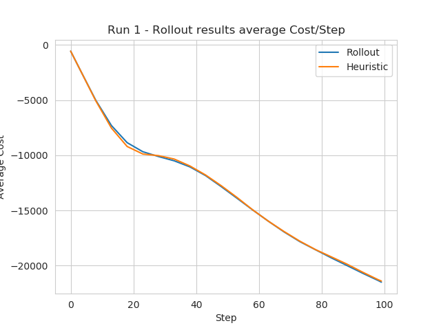

# Forest Fire Rollout implementation.
Fork from the ForestFire Environment:
	Forest Fire Environment Maker for OpenAI Gym. 
	*gym_forest_fire* 
	*version 2.4*

## A gif from the Demo file.

## The graph from that run

### Draft
A butchered version to implement in somehow efficient; using Python on CPU only, the rollout algorithm
to train an agent inside a Forest-Fire celular automata.

This fork uses a modified version from the the gym environment to suit the project's needs. It's advise to run
this as shown on the folder.

